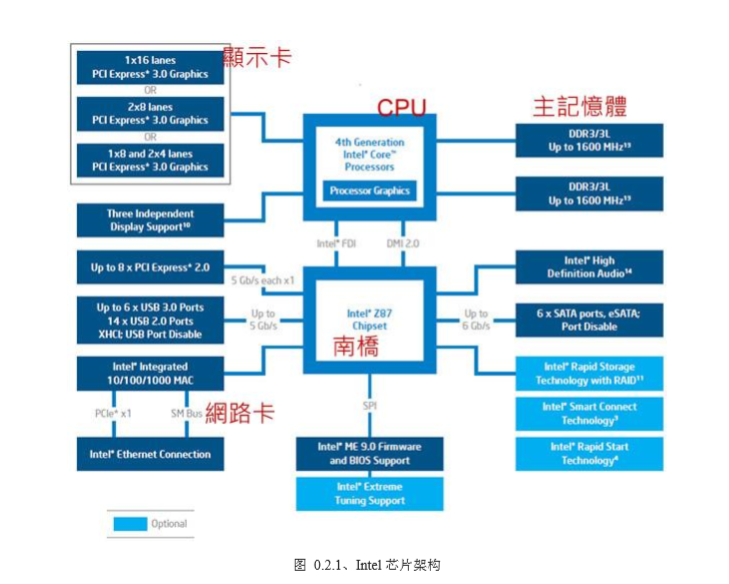
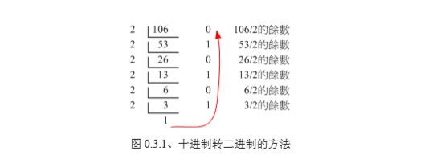

# 计算机概论
## 0.1 计算机硬件的五大单元
* 计算机主要分为5个部分（运算器、存储器、控制器、输入设备、输出设备），如下图：


## <mark>CPU
### 0.1.1 了解CPU
  * CPU为一个具有特定功能的芯片，里面含有微指令集。

  * CPU是整个电脑的核心，CPU分为两个主要的单元：算数逻辑单元（运算器）、控制单元（控制器）
  ```
     算数逻辑单元：负责程序运算与逻辑判断
     控制单元：协调各周边组件与各单元的工作。
   ```

  * <mark>CPU的重点：进行运算与判断
```
  进行运算与判断的数据：从主存储器中来
  数据:输入单元-主存储器-CPU-主存储器-输出单元
```

### 0.1.2 CPU的架构
* 目前世界上常见的两种主要的CPU架构：精简指令集（RISC）、复杂指令集（CISC）

#### 精简指令集（RISC）
* 精简指令集（RISC）特点
```
  微指令集精简
  每个指令运行时间很短
  指令的执行性能较佳
  复杂的事情则需要由多个指令来完成
```
* 常见的RISC微指令集
```
 甲骨文（Oracle）的SPARC系列
 IBM公司：Power Architecture系列
 ARM CPU
```

#### 复杂指令集（CISC）
* 复杂指令集（CISC）特点
```
  CISC指令可以执行一些较低级的硬件操作
  指令数目多且复杂
  每条指令长度并不相同
```
* 常见的CISC微指令集
```
  AMD
  Intel
  VIA
```
AMD、Intel、VIA所开发出来的x86架构的CPU被大量使用于个人计算机用途，个人计算机通常也称为x86计算机。
```
Q：为什么成为x86架构呢？
R：因为最早那颗Intel发展出来的CPU代号为8086。
Q：什么是位？（x86_64位）
R：64位：CPU一次可以读取64bits的数据。
Q：32位的软件能在64位CPU上使用么？
R：可以，因为不足的位以0填充，但是反过来不行。
```

## 其他单元的设备
* 在主机机壳内的设备大多是透过主板连接，主板上面有个连接沟通所有设备的芯片组，芯片组将所有单元设备链接起来。
* 其他单元的重要设备有：<mark>系统单元</mark>、<mark>记忆单元</mark>、<mark>输入、输出单元</mark>

### <mark>系统单元</mark>
* 系统单元主要包括CPU与内存及主板相关组件。

### 记忆单元
* 包括<mark>主存储器（RAM）</mark>、辅助内存。辅助内存：硬盘、软盘、光盘等。
### 输入、输出单元
* 输入单元：键盘、鼠标、体感装置等；输出单元：打印机、喇叭等。

## 0.1.3 计算机用途的分类
* 以计算机的复杂度和运算能力进行分类

### 超级计算机
```
  运作速度最快的计算机
  用途：国防军事、气象预测、太空科技等
```

### 大型计算机
```
  拥有数个高速CPU
  用途：大型企业的主机、全国性的证券交易所企业
```
### 迷你计算机
```
  支持多用户
  用途：科学研究、工程分析等
```
### 工作站
```
  针对特殊用途而设计的计算机
  用途：学术研究、工程分析
```

### 微电脑
```
  个人计算机
  类型：桌上型、笔记本型
```

## 0.1.4 计算机上常用的计算单位（容量、速度等）
### 容量单位
* 0/1二进制单位称为bit，存储数据时每份简单的数据都会使用8个bits来记录，因此定义出byte
```
  1 byte = 8 bits
```
* 常见的单位与进位制对应：

| 进位制 | Kilo | Mega | Glga | Tera | Peta | Exa | Zetta |
|:-- |:-- |:-- |:-- |:-- |:-- |:-- |:-- |
| 二进制 | 1024 | 1024k | 1024M | 1024G | 1024T | 1024P | 1024E |
| 十进制 | 1000 | 1000k | 1000M | 1000G | 1000T | 1000P | 1000Z |

```
一般地，
文件容量使用的是二进制的方式：
1 GBytes = 1024x1024x1024 Byte
速度单位则尝试用十进制
1 GHz = 1000x1000x1000 Hz
```
### 速度单位
* CPU的指令周期常使用MHz或者GHz之类的单位，Hz：秒分之一。
```
  Q：为什么买的500GU盘格式化完毕后只有460G左右的容量？
  R：硬盘制造商一般使用十进制单位，
     因为硬盘的最小物理量为512Byte，
     最小的组成单位为扇区（Sector),
     通常硬盘容量的计算采用多少个sector
```

## 0.2 个人计算机架构与相关设备组件
* 以2015年Intel主板架构为例子：



* 早期的芯片组通常分为两个网桥来控制各组件的沟通，分别是<mark>南桥</mark>和<mark>北桥</mark>
```
  北桥：负责连接速度较快的CPU、主存储器与显示适配器界面等组件
  南桥：负责连接速度较慢的装置接口，包括硬盘、USB、网络卡等
  因为北桥最重要的是CPU与主存储器之间的桥接，大多将北桥内存控制器整合到CPU封装中
```

### 0.2.1 CPU
* 频率就是CPU每秒中可以进行的工作次数。频率越高，表示CPU单位时间内可以做更多的事情
```
  不同CPU之间不能单纯以频率来判断运算效能（不同CPU，微指令不同，架构也不同）
  频率仅能用来比较同款CPU的速度
```

#### CPU的工作频率：外频与倍频
* 外频：CPU与外部组件进行数据传输时的速度
* 倍频：CPU内部用来加速工作效能的一个倍数
* 外频 x 倍频 = CPU的频率速度
```
  例如:某CPU的内频为3.0GHz，外频是333MHz，则：
       倍频 = 2.3x1000Mhz / 33MHz = 9
```

#### 32位与64位的CPU与总线（宽度）
* CPU内的内存控制芯片与主存储器间的传输速度（前端总线速度），CPU可以从内存中取得的最快带宽与总线宽度类似
* CPU每次能处理的数据量称为字组大小，字组大小依据CPU的设计有32位与64位。

#### 超线程
* 暂无

### 0.2.2 内存
* 个人计算机的主存储器主要组件为动态随机存取内存（Dynamic Random Access Memory ，DRAM），随机存取内存只有在通电的时才能记录与使用，断电后数据就消失，因此也称为RAM为挥发性内存。

#### 多通道设计
* 传统的总线宽度一般大约仅为64位，为了加大这个宽度，芯片组厂商将两个主存储器汇整在一起，如果一支内存可达64位，那么两支内存就可达128位了，这就是双通道的设计理念。

#### DRAM与SRAM
* CPU除了主存储器，还有很多，比较熟悉的是：第二层高速缓存。
```
  现在知道CPU的数据都是由主存储器提供，但CPU到主存储器之间还是得透过内存孔控制器呢！
  如果某些很常用的程序或者数据可以放到CPU内存的话，那么CPU数据读取就不需要跑到主存储器重新读取了！
  对于效能而言就可以大大的提升了！
  这就是二层快取的设计概念。
```
* 第二层快取与主存储器及CPU的关系如下图：

 

 ```
 因为第二层快取（L2 Cache）整合到CPU内部，因此这个L2内存的速度必须与CPU频率相同。使用DRAM是无法达到这个频率速度，此时需要静态随机存取内存（SRAM）
 ```
 ```
 SRAM: 晶体管数量较多，价格较高，且不易做成大容量，但是速度快！
       因此整合到CPU内成为高速缓存以加快数据的存取是个不错的办法！
 ```

#### 只读存储器
* BIOS是一套程序，这套程序是写死在主板上面的一个内存芯片中，这个内存芯片在没有通电时也能将数据记录下来，那就是只读存储器（ROM）

### 0.2.3 显示适配器
* 显示适配器又称为：VGA(Video Graphics Array)

### 0.2.4 硬盘与存储设备
#### 硬盘的物理组成
* 硬盘盒内由许许多多的圆形磁盘等、机械手臂、磁盘读取头与主轴马达所组成

 
 ```
  实际数据都是写在具有磁性物质的磁盘盘头上，而读写主要是透过机械手臂上的读取头来达成。
  实际运作时，主轴马达让磁盘盘转动，然后机械手臂可伸展让读取头在磁盘盘上头进行读写的动作
  另外，由于单一磁盘盘的容量有限，因此有的硬盘内部会有两个以上的磁盘盘哦~
 ```

#### 磁盘盘上的数据
* 磁盘盘上的数据如下图所示：

 
```
  由于磁盘是圆的，透过机械手臂去读写数据，磁盘盘要转动才能让机械手臂读写
  数据写入就是以圆圈转圈的方式读写
```
* 小区快就是磁盘的最小物理存储单位，称之为<mark>扇区</mark>，同一个同心圆组合成的圆就是所谓的磁道。所有磁盘盘上面的同一个磁道可以组合成所谓的磁柱
* 通常数据的读写会由外圈开始往内写哦~

## 0.3 数据表示方式
### 0.3.1 数字系统
* 用十进制表示3456：
</br>
  3456 = 3x10<sup>3</sup> +4x10<sup>2</sup> +5x10<sup>1</sup>+6x10<sup>0</sup>
* 用二进制表示1101010：
</br>
  1101010 = 1x2<sup>6</sup>+1x2<sup>5</sup>+0x2<sup>4</sup>+1x2<sup>3</sup>+0x2<sup>2</sup>+0x2<sup>0</sup>
* 十进制转换二进制的方法：

  

  最后的写法就如上面的红色箭头，由最后数字往上写。

### 0.3.2 文字编码系统
* 计算机的文本文件都被记录为0/1，必须要经过一个编码系统的处理。所谓编码系统可以想象成一个字码对应表，概念如下：

  
* 常用的英文编码表为ASCII系统
* 国际组织ISO/IEC定制了Unicode编码系统，常称为UTF8或者万国码的编码。

## 0.4 软件程序运作
### 0.4.1 操作系统
* 操作系统（OS）也是一组程序，这组程序的重点在管理计算机的所有活动以及驱动系统中所有硬件。
