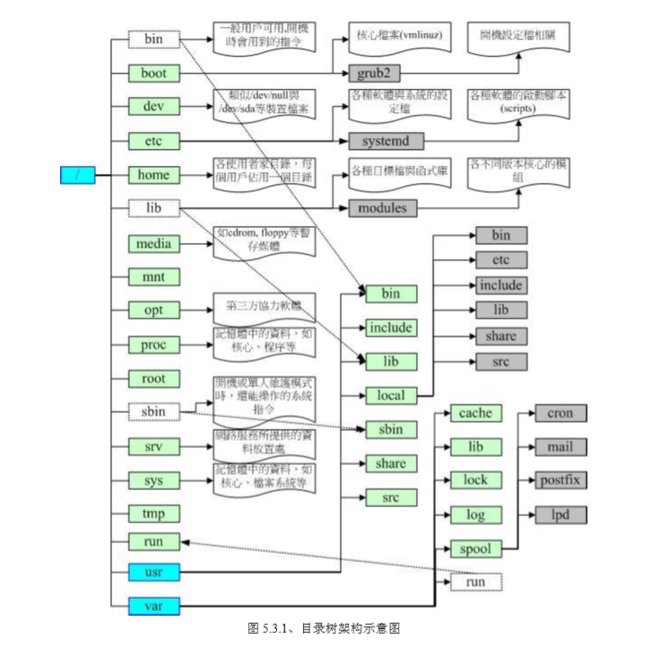

# 04.Linux文件种类

## 04.1 Linux目录配置的依据--FHS
### 04.1.1 了解FHS
* 目的：让使用者可以了解到已安装软件通常放置于哪个目录下
* FHS依据文件系统使用的频繁与否与是否允许使用者随意改动，将目录定义成为四种交互作用的形态。

|  | 可分享的 | 不可分享的 |
|:-- |:-- |:-- |
| 不变的 | /usr(软件放置处) | /etc(配置文件) |
| 不变的 | /opt(第三方协力软件) | /boot(开机与核心档) |
| 可变动的 | /var/mail(使用者邮件信箱) | /var/run(程序相关) |
| 可变动的 | /var/spool/news(新闻组) | /var/lock(程序相关) |

* 可分享的：可以分享给其他系统挂载使用的目录，所以包括执行文件与用户的邮件等数据，是能够分享给网络上其他主机挂载用的目录
* 不可分享的：自己机器上面运作的装置文件或是与程序有关的socket文件等，由于仅与自身机器有关，所以不适合分享给其他主机
* 不变的：有些数据是不会经常变动的，跟随着distribution而不变动，例如函数式、文件说明文件、系统管理员所管理的主机服务配置文件等等
* 可变动的： 经常改变的数据，例如登录文件、一般用户可自行收受的新闻组等

### 04.1.2 目录的定义

| 目录 | 定义 |
|:-- |:-- |
| /root | 与开机系统有关 |
| /usr | 与软件安装/执行有关 |
| /var | 与系统运作有关 |

#### 根目录(/) 的意义与内容
  * 根目录是整个系统最重要的一个目录，不仅因为所有目录都是由根目录衍生出来的，还因为根目录与开机/还原/系统修复等动作相关。
  * FHS建议：根目录所在分区槽应该越小越好，且应用程序所安装的软件最好不要与根目录放在同一个分区槽内，保持根目录越小越好。如此不仅效能较佳，根目录所在的文系统也不容易发生问题
  * FHS定义出根目录底下要有这些次目录的存在才好：

| 目录 | 应放置文件内容 |
|:-- |:-- |
| 第一部分| FHS要求必须存在的目录 |
| /bin | /bin放置的是在单人维护模式下还能够被操作的命令。在/bin底下的指令可以被root与一般账号所使用，主要有cat，chmod，chown等 |
| /boot | 放置开机会使用到的文件，包括Linux 核心文件以及开机选单与开机所需配置文件等，Linux kernel常用档名为：vmlinuz |
| /dev | 任何装置与接口设备都是以文件的形态存在于这个目录中 |
| /etc | 系统主要的配置文件放置在这个目录内，例如人员账号密码文件、各种服务的启始档等等，FHS建议不要放置可执行文件(binary)在这个目录中 |
| /lib | 开机时会用到的函式库,以及在/bin或/sbin底下的指令会呼叫的函式库而已 |
| /media | 放置可移除的装置 |
| /mnt | 暂时挂载 |
| /opt | 给第三方软件放置的目录 |
| /run | 系统开机后所产生的各项信息，/run可以使用内存来仿真 |
| /sbin | 开机过程中所需要的，里面包括了开机、修复、还原系统所需要的指令 |
| /srv | 一些网络服务启动后，这些服务所需要取用的数据目录 |
| /tmp | 一般用户或者是正在执行的程序暂时放置文件的地方，这个目录是任何人都能够存取的，需要定期清理 |
| /usr | 第二层 FHS设定，后续介绍 |
| /var | 第二层 FHS设定，主要为放置变动性的数据，后续介绍 |


| 目录 | 应放置文件内容 |
|:-- |:-- |
| 第二部分| FHS建议可以存在的目录 |
| /home | 系统默认的家目录，~代表目前这个用户的家目录 |
| /lib<qual> | 用来存放与/lib不同的格式的二进制函式库，例如支持64位的/lib64函式库等 |
| /root | 系统管理员的家目录 |

* Linux中比较重要的几个目录

| 目录 | 应放置文件 |
|:-- |:-- |
| /lost+found | 使用标准的ext2/ext3/ext4文件系统格式才会产生的目录，目的在于当文件系统发生错误时，将一些遗失的片段放置到这个目录下，如果使用的是xfs文件系统的话，就不会存在这个目录了 |
| /proc | 目录本身是一个虚拟文件系统，放置的数据都是在内存中的 |
| /sys | 其实与/proc非常类似，也是一个虚拟文件系统，主要是记录核心与系统硬件信息较相关的信息，这个目录同样不占硬盘容量哦|

#### /usr 的意义与内容
* usr = Unix Software Resource，就是Unix操作系统软件资源所放置的目录，而不是用户的数据哦
* /usr的次目录建议底下有这些：

| 目录 | 应放置文件内容 |
|:-- |:-- |
| 第一部分 | FHS要求必须存在的目录 |
| /usr/bin/ | 所有一般用户能够使用的指令都放在这里，centos7将用户的全部指令放置于此，而使用连结档的方式将/bin连结至此！可以说，/usr/bin与/bin一模一样 |
| /usr/lib/ | 基本与/lib相同，所以/lib就是链接到此目录中的 |
| /usr/local/ | 系统管理员在本机自行安装自己下载的软件(非distribution默认提供者)，建议安装到此目录 |
| /usr/sbin/ | 非系统正常运作所需要的系统指令，基本功能与/sbin差不多 |
| /usr/share/ | 主要放置只读架构的数据文件，当然也包括共享文件，在这个目录下放置的几乎都是文本文件 |


| 目录 | 应放置文件内容 |
|:-- |:-- |
| 第二部分| FHS建议可以存在的目录 |
| /usr/games/ | 与游戏比较相关的数据放置处 |
| /usr/include/ | c/c++等程序语言的档头(header)与包含档(include)的放置处 |
| /usr/libexec/ | 某些不被一般使用者惯用的执行档或脚本等 |
| /usr/lib<qual>/ | 与/lib<qual>功能相同 |
| /usr/src/ | 一般原始码建议放置到这里，src有source的意思 |

#### /var 的意义与内容
* /usr是安装时会占用较大硬盘容量的目录，/var就是在系统运作后才会渐渐占用硬盘容量的目录
* /var目录主要针对常态性变动文件，包括快取(cache)、登录当(log file)以及某些软件运行所产生的文件，包括程序文件(lock file，run file)，或者例如MySQL数据库文件等
* 常见的次目录有：

| 目录 | 应放置文件内容 |
|:-- |:-- |
| 第一部分 | FHS要求必须存在的目录 |
| /var/cache/ | 应用程序本身运作过程中会产生的一些暂存档 |
| /var/lib/ | 程序本身执行过程中，需要使用到的数据文件放置的目录，在此目录下各自的软件应该要有各自的目录 |
| /var/lock/ | 某些装置文件或者是文件资源一次只能被一个程序所使用，如果同时有两个程序使用该装置时，就可能产生一些错误的状况，因此就得要将该装置上锁(lock)，以确保该装置只会给单一软件所使用 |
| /var/log/ | 这是登录文件放置的目录，非常重要 |
| /var/mail/ | 放置个人电子邮箱的目录 |
| /var/run/ | 某些程序或者是服务启动后，会将他们的PID放置在这个目录下！|
| /var/spool/ | 这个目录通常放置一些队列数据，所谓的队列就是排队等待其他程序使用的数据，这些数据被使用后通常都会被删除！ |

## 04.2 目录树
* 在Linux底下，所有的文件与目录都是由根目录开始的，然后一个一个分支下来，有点像是树枝状，因此，将这种目录配置方式成为：目录树
* 目录树的特性：
  * 目录树的启始点为根目录(/root)
  * 每一个目录不止能使用本地端的partition文件系统，也可以使用网络上的filesystem
  * 每一个文件在此目录树的文件名(包含完整路径)都是独一无二的
  * 目录树架构示意图如下：

  


## 04.3 绝对路径与相对路径
* 根据档名写法的不同，也可将所谓的路径定义为绝对路径与相对路径
  * 绝对路径：由根目录(/)开始写起的文件名或目录名称
  * 相对路径：相对于目前路径的文件名的写法
* . : 代表当前目录，也可以使用 ./ 来表示
* .. : 代表上一层目录，也可以用 ../ 来表示

#### 例题
* 如何先进入/var/spool/mail/目录，再进入/var/spool/scorn/目录内？
```
答： 由于/var/spool/mail/与var/spool/corn/目录是同样在/var/spool/中的，因此最简单的指令下达方法为：
1. cd /var/spool/mail/
2. cd ../cron
```
* 网络文件中常常提到类似 ./run.sh 之类的数据，这个指令的意义为何？
```
答：由于指令的执行通常需要变量的支持，若你的执行文件放置在本目录，并且本目录并非正规的执行文件目录(/bin,/usr/bin等为正规)，此时要执行指令就得要严格指定该执行档， ./ 代表本目录的意思，所以 ./run.sh 代表执行本目录下，名为run.sh的文件哦~
```
