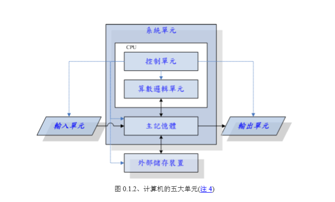

# 计算机概论
## 0.1 计算机硬件的五大单元
* 计算机主要分为5个部分（运算器、存储器、控制器、输入设备、输出设备），如下图：


## <mark>CPU
### 0.1.1 了解CPU
  * CPU为一个具有特定功能的芯片，里面含有微指令集。

  * CPU是整个电脑的核心，CPU分为两个主要的单元：算数逻辑单元（运算器）、控制单元（控制器）
  ```
     算数逻辑单元：负责程序运算与逻辑判断
     控制单元：协调各周边组件与各单元的工作。
   ```

  * <mark>CPU的重点：进行运算与判断
```
  进行运算与判断的数据：从主存储器中来
  数据:输入单元-主存储器-CPU-主存储器-输出单元
```

### 0.1.2 CPU的架构
* 目前世界上常见的两种主要的CPU架构：精简指令集（RISC）、复杂指令集（CISC）

#### 精简指令集（RISC）
* 精简指令集（RISC）特点
```
  微指令集精简
  每个指令运行时间很短
  指令的执行性能较佳
  复杂的事情则需要由多个指令来完成
```
* 常见的RISC微指令集
```
 甲骨文（Oracle）的SPARC系列
 IBM公司：Power Architecture系列
 ARM CPU
```

#### 复杂指令集（CISC）
* 复杂指令集（CISC）特点
```
  CISC指令可以执行一些较低级的硬件操作
  指令数目多且复杂
  每条指令长度并不相同
```
* 常见的CISC微指令集
```
  AMD
  Intel
  VIA
```
AMD、Intel、VIA所开发出来的x86架构的CPU被大量使用于个人计算机用途，个人计算机通常也称为x86计算机。
```
Q：为什么成为x86架构呢？
R：因为最早那颗Intel发展出来的CPU代号为8086。
Q：什么是位？（x86_64位）
R：64位：CPU一次可以读取64bits的数据。
Q：32位的软件能在64位CPU上使用么？
R：可以，因为不足的位以0填充，但是反过来不行。
```

## 其他单元的设备
* 在主机机壳内的设备大多是透过主板连接，主板上面有个连接沟通所有设备的芯片组，芯片组将所有单元设备链接起来。
* 其他单元的重要设备有：<mark>系统单元</mark>、<mark>记忆单元</mark>、<mark>输入、输出单元</mark>

### <mark>系统单元</mark>
* 系统单元主要包括CPU与内存及主板相关组件。

### 记忆单元
* 包括<mark>主存储器（RAM）</mark>、辅助内存。辅助内存：硬盘、软盘、光盘等。
### 输入、输出单元
* 输入单元：键盘、鼠标、体感装置等；输出单元：打印机、喇叭等。

## 0.1.3 计算机用途的分类
